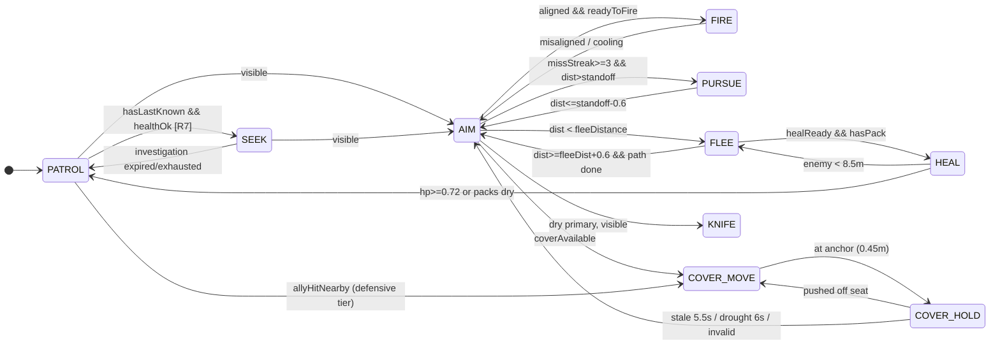

# Bot FSM behavior audit — bot-viewer-v2 (2026-07-25)

Five-agent parallel audit of the bot AI: one state-machine mapper plus four analysts
(conflicting states, lemmings behavior, missed synergy, situational awareness).
Read-only; no code was changed.

**Line-number baseline:** most refs are against the 5479-line `bot-viewer-v2.html`;
the conflicting-states section was re-verified against a 5500-line version that appeared
mid-audit (an allocation-free refactor was landing concurrently), so anchors in other
sections may drift by up to ~21 lines in the back half of the file.

---

## 1. The state machine as it actually exists

Ten core states from `bot-activity.js` (PATROL, SEEK, PURSUE, FLEE, HEAL, KNIFE, AIM,
FIRE, COVER_MOVE, COVER_HOLD) chosen by the pure priority ladder `chooseBotState`
(bot-activity.js:32-99), plus **four harness pseudo-states** that bypass or overwrite it:

- `'reposition'` (muzzle recovery) — checked *before* the ladder and `return`s (4162-4170).
- `'alert'` (alert hold) — overwrites PATROL only (4316-4322).
- `MEDIC_MOVE` / `MEDIC_TEND` — medic duty overwrites everything except FLEE/KNIFE/healRequested (4298-4304).
- plus the `beingHealed` locomotion freeze (4330-4341) and the `'dead'` record sentinel.

Ladder priority (first match wins): heal commitment → knife → flee commitment → cover
commitment → visible-target rungs (flee-range / pursue-on-miss / cover entry / aim / fire)
→ ally-hit cover → seek-on-last-known → patrol. Hysteresis exists on flee/pursue distance
(0.6 m buffers), cover validity (0.35 s grace + 0.8 s switch cooldown), and heal safety
(500 ms hold).

Per-bot state uses a register-bank pattern: module-level `let`s bound/committed per actor
via `withBotActor` (2787-2865). The mapper and conflicts agent independently verified the
bind/commit lists are complete — **no cross-bot state bleed** except one ordering case
(finding C11 below).

Supporting layers: alert/escalation tiers (wary/defensive/push, bot-alert.js), attention
sweep, cover gate + peek cycle (bot-cover.js), medic duty + patient claims (bot-medic.js),
health-pack seeking, goal claims (`'flee'|'cover'|'pack'|'recover'`, bot-separation.js),
separation steering + hard pushout, muzzle recovery, reload (non-state).

Housekeeping found by the mapper:
- `bot-state-machine.html` is **stale** — derived from v1, predates cover/medic/alert/pack layers.
- Dead config: `botBehaviorSettings.pursueDistance` (7.0) and `preferredCombatDistance` (5.0)
  are never read (superseded by `botWeaponStandoff`); `knifeEngagementDistance` only scales a debug ring.
- `ALERT_HOLD_MAX_MS` is 20000 in code, documented as 10 s in bots.md.

### Core FSM diagram

Overrides not shown: `'reposition'` preempts everything but heal; `'alert'` overrides
PATROL; medic duty overwrites all but FLEE/KNIFE; `beingHealed` freezes
PATROL/SEEK/PURSUE/FLEE locomotion.

---

## 2. Cross-validated headline findings

Independently found by 2+ agents; these are the highest-confidence items.

### H1. `exposedToThreat` is written, tested, documented — and called by nothing (3 agents)
`bot-alert.js:94-98`, tested in `test-bot-alert.mjs:99-112`, described in bots.md as the
alert-hold gate. The actual gate (`wantAlertHold`, ~4321) has no exposure term, so the
alert hold freezes a bot **wherever it stands — including mid-open-lane — for up to 20 s**
facing the reported bearing. bots.md records the gate was deliberately removed 2026-07-24;
the removal traded an inconsistent gate for a consistently bad hold. Fix is one import +
one clause (hold if concealed; otherwise keep moving / take the cover rung).

### H2. Escalation inverts self-preservation: two deaths *disable* cover (lemmings, severe)
`alertEscalation` scores deaths ×2; score ≥ 4 with 3+ nearby teammates = `push` tier, which
sets `coverAlert = null` (only `defensive` feeds the cover rung) and never holds. So:
1 graze → pause; 1 death → cover; **2 deaths → the whole surviving squad drops cover
eligibility, inherits the same `lastKnownTarget`, and walks at the shooter in the open.**
The 8 s death window + each new death re-arms it, so the push tier self-sustains through a
squad wipe. Fix: make push a superset of defensive (keep `coverAlert` in both tiers).

### H3. No danger memory anywhere — bots recycle the exact spot squadmates just died (4 agents)
- Death releases the corpse's `'cover'` claim the same frame (1506); `pickCoverCorner`
  scores by distance, so the corner a bot just died at is immediately the top pick for the
  next bot standing behind it.
- `coverBlacklist` is per-bot, fed only by the owner's own streaks, and **cleared on death** (1513).
- Nothing feeds casualty positions (`recentAllyHits` carries x,z + lethal) into flee scoring,
  patrol re-entry, pack runs, medic approach, or A* cost.
Player-visible symptom: bots take turns dying at the identical corner, stepping over their
own corpses. Fix shape: a decaying team-scoped danger field written on `killCombatBot`,
read as a penalty term in the four existing scoring loops (each is one additive term).

### H4. Being shot never creates a search anchor (situational awareness, critical)
`selfThreat` (the shooter position a victim demonstrably receives — it aims at it) is used
only for facing; it is **never written to `lastKnownTarget`**, and `latestAlertNear`
explicitly skips self-reports. A bot shot from an unseen doorway aims at it for 3 s
(`ALLY_ALERT_WINDOW_MS`), then resumes patrol with zero residue — repeatable forever.
Fix: seed `lastKnownTarget` from `selfThreat`, which converts the worst "AI is fake" tell
into the existing (and genuinely good) SEEK/investigation machinery.

### H5. Deterministic convergence on one cell (lemmings, severe)
`beginInvestigation`'s frontier is ring-ordered from the last-known cell, ring 0 first —
every seeking bot's first goal is *literally the enemy's last position*. A* is fully
deterministic with static costs and there is **no `'seek'` goal claim** (claims exist only
for flee/cover/pack/recover), so N bots produce N identical paths: single-file through one
doorway, cut down in order. Fix: a `'seek'` claim kind (mirrors the pack pattern, ~4 lines)
plus per-bot offsets on the shared anchor.

### H6. Single-threat tunnel vision (SA + synergy)
One target slot, 120° body-yaw FOV gating all perception, and every spatial decision
(cover validity, corner pick, flee scoring) computed against **one** threat position.
Consequences: a bot in AIM/FIRE can be knifed from behind without reacting (no cue can
preempt committed aim); in 2vN fights bots hide from enemy A while standing open to enemy B
and hold there on the peek metronome. Cheapest meaningful fix: a `secondaryThreat` slot
used only to veto cover corners, plus a spin-on-close-self-threat rung above the aim rungs.

---

## 3. Conflicting states (agent 2; line refs = 5500-line file)

- **C1 (HIGH) — Pack claims without intent.** The per-tick pack scan claims a pack cell for
  any bot with carry room (`canHold` ≈ always true for riflemen at 1/2 packs) even in
  FIRE/COVER_HOLD/PURSUE, where nothing ever walks to it. Wounded packless bots skip the
  claimed pack, log "heal abandoned", and rejoin at 25% HP next to an untouched pack. The
  phantom claim also blocks that cell for flee/cover/recover pickers (shared cell namespace).
- **C2 (HIGH) — Cover commit-timeout blacklists good corners.** `timedOut` compares against
  `coverStartedAt` (stamped only at commit), not time-in-COVER_MOVE. A bot holding a corner
  >6 s that gets shoved 0.5 m by the pushout pass re-enters COVER_MOVE with the timeout
  already expired → corner blacklisted **for life**. Combined with C14 (blacklist never
  decays), long-lived bots monotonically lose all cover in the room.
- **C3 (HIGH) — HOLD↔MOVE flap starves the peek cycle.** `atCoverAnchor` (0.45 m) vs
  pushout displacement (~0.3 m+) lets crowded bots flip states every few frames; each flip
  nulls `peek` and `coverHoldSince`, so the bot never completes a peek, never fires, and
  the 6 s drought exit never accumulates. Also an unbudgeted full A* per flip (C15:
  `updateCoverMoveMovement` uses raw `requestPath`).
- **C4 (HIGH) — Medic heal-hold pins fleeing bots.** BOT_FLEE is in the `beingHealed` yield
  list; the 500 ms lease refreshes every frame the medic is within 6 m by path. A wounded
  bot mid-retreat freezes in the enemy's lane (its flee path wiped every frame) while the
  medic walks over — often to a corpse.
- **C5 (HIGH) — `botMissStreak` never resets on target switch/disengage.** Only resets are
  "hit current target" and "no live enemy exists at all" (skipped in any multi-bot fight).
  One bad engagement → `keepsMissing` true for life → the bot permanently charges instead
  of taking long shots.
- **C6 (MED) — `'reposition'` preempts everything but heal** and skips end-of-tick cleanup:
  stale flee claims and committed cover corners stay held for the whole episode; no reload
  can start; the bot faces travel direction, not its shooter. On exit, the non-`BOT_*`
  sentinel makes every `current === BOT_X` commitment test false (drops flee commitment).
- **C7 (MED) — Attention sweep defeats the peek window.** A cover-holder sweeps ±0.95 rad;
  if the sweep is near its extreme when the peek slides out, the threat falls outside the
  120° cone → `visible` false → entire 1.2 s exposure passes without acquiring or firing,
  and `peekMissStreak` (fired-shots only) never corrects it.
- **C8 (MED) — No hysteresis on `visible`.** One lost frame → SEEK → full investigation
  BFS + frontier sort; one regained frame → nulled. Doorway strafe fights rebuild the
  frontier every other frame (frame-time spikes + visible stutter).
- **C9 (MED) — Medic duty overrides committed cover/AIM/FIRE** after the ladder; the ladder
  keeps computing `coverProbe` every frame for a corner the medic can never commit.
- **C10 (MED) — Flee-to-pack has no threat-direction test.** The most common pack source is
  a fresh corpse at the enemy's feet; the 30%-HP survivor sprints at 1.24× speed *toward
  the enemy* to loot it, while its old flee-cell claim stays locked.
- **C11 (MED) — Self-blast heal loss.** `beginBotHealthRetreat` writes actor fields
  directly; when the victim is the currently-bound actor (grenade/RPG self-damage),
  `commitBotActor` clobbers them with stale globals — the bot never retreats. Flaky,
  focus-dependent.
- **C12-C15 (LOW)** — `applyCombatDamage` stomps `botState` mid-tick; `healUnsafe` has no
  exit buffer (HEAL↔FLEE pump at ~8.5 m); life-scoped blacklist (see C2); unbudgeted A* in
  cover-move (see C3).

## 4. Lemmings behavior (agent 3)

Beyond H2/H3/H5 above:
- **L5 — Flee scores destination only.** Endpoint-only cover bit, straight-line threat
  distance mixed with path distance, no exposure along the route — bots run across the
  shooter's muzzle to reach a "covered" cell behind him. `fleeSearchRadius: 5` cells =
  2.5 m, and `coverScore: 12` dominates, so 4 fleeing bots huddle behind the same crate in
  adjacent cells.
- **L6 — Synchronized pursue break.** PURSUE outranks cover entry in the ladder; peek-miss
  releases (limit 6) fire within seconds of each other across a squad engaging the same
  target → mass simultaneous charge. (Bots *already committed* to cover are protected by
  the commitment rung — credit where due.)
- **L7 — Shared patrol ring.** Both teams share one `patrolPoints` array and every actor
  spawns at `patrolIndex: 0` → 8-bot conga line. One-line fix: `nextBotId % patrolPoints.length`.
- **L8 (structural) — A* is blind to other bots.** Static costs, deterministic; all
  anti-clumping is post-hoc (separation steer, pushout, waypoint-contest relax), which
  degrades to "queue up" in corridors. The right layer for congestion/danger cost.
- **L9-L10 (LOW)** — `createGoalClaims.claim` can cross-kind-evict when one bot claims the
  same cell under two kinds (latent; all current call sites check first);
  `selectBotTarget`'s `firstLive` fallback latches the whole team onto one arbitrary enemy.

## 5. Missed synergy (agent 4)

The squad layer is sensor-side only: bots share **damage events and nothing else**, while
the transport (`recentAllyHits` + `alertReport`), arbitration (`goalClaims`), the baked
visibility field, and a proven bot→bot command channel (`healHoldUntil`) all exist and are
load-bearing elsewhere. Two built-and-tested capabilities imported by nothing:
`exposedToThreat` (H1) and `pickSquadLeader` (bot-roles.js:61).

Small wiring, large payoff (each ~one term/branch in an existing loop):
- **S2 — Sighting reports.** Seeing an enemy publishes nothing; only being *hit* does. A
  rate-limited `'contact'` report kind (excluded from escalation scoring) lets first
  contact orient the squad — the single biggest structural unlock.
- **S4 — Danger terms** in flee/patrol-resume/pack/medic scoring from the casualty ring (= H3).
- **S3 — `'seek'` claims** on investigation goals (= H5) → squads fan out, rooms clear ~3× faster.
- **S5 — Team-scoped cover blacklist** seeded on death.
- **S6 — Focus-fire/spread term** in target selection (currently distance-only, no
  awareness of what teammates engage).
- **S7 — Sweep phase offsets** — standing groups sweep in phase and share one blind arc;
  offsetting `sweepSince` by roster index gives the group 360°.
- **S8 — `'allyDown'` cover-hold exit reason** — `coverHoldExitReason` is the designed
  extension point but only sees clock+LOS facts; a squadmate dying 3 m away doesn't
  disturb a hold aimed at the original threat.
- **S9 — Flee toward the squad centroid** (`teamCentroid` already exists in bot-medic.js)
  — wounded bots currently retreat into empty map where the medic can't find them.

Medium effort, higher ceiling:
- **S10 — Alternating peeks.** Jitter decorrelates but doesn't alternate; phase-offset
  peek cycles per shared-threat cover group = continuous fire with one bot exposed at a
  time — the most readable "they're cooperating" behavior available.
- **S11 — Real push tier.** Push currently = seed lastKnown + orange marker, then N
  independent SEEKs. `livingTeammatesNear` already enumerates the group;
  `pickSquadLeader` + leadership weights are tested and unused → base-of-fire + flank.
- **S12 — Medic × cover.** `decideMedicAction` has no cover concept; MEDIC_TEND channels
  (and pins the patient!) wherever they fell, including the shooter's lane.
- **S13 — Generalize `healHoldUntil` → `holdUntil`/`holdReason`.** It's the only bot→bot
  command channel and already handles the FSM priority nuances (held bots keep firing);
  generalized, it's the cheapest route to bounding overwatch.
- **S14 — Pursue pincer.** Claim the standoff cell, rotate bearing ±30-45° per additional
  claimant.

Visibility-field roll-up — consulted at 5 sites today, missing from: alert hold (H1),
pack runs, patrol re-entry, medic approach/tend, pursuit standoff, knife charge.

## 6. Situational awareness (agent 5)

Beyond H4/H6 above:
- **A4 — Patrollers never look around.** `faceMovement` locks yaw to velocity; the sweep
  only runs while *stationary*. Fixed 120° forward cone, 240° permanent blind arc — follow
  a patroller at 3 m behind, forever. The tested sweep primitive just isn't wired in.
- **A5 — Moving alerted bots sweep exactly two bearings** (threat / travel), no per-bot
  phase → the whole file shares the same blind flank at the same instant.
- **A6 — Semi-alert changes nothing perceptually.** Tiers feed markers/cover/hold only —
  never FOV width, sight distance, scan stride, or reaction. The orange `!` promises
  alertness the perception model doesn't deliver.
- **A7 — No interception; search bubble grows 5× too slow.** Pursuit paths to present
  position (permanent trailing); investigation expands at 0.55 m/s vs 3.5-4 m/s target
  speed → diligent 8 m bubble-clear while the target is two rooms away. (Present-position
  *aim* is fine — hitscan.)
- **A9 — Reload has zero tactical awareness.** Starts only at mag=0, unconditional on
  exposure; during it the ladder holds AIM — stationary, in the open, pointing an empty
  rifle. No top-off during peek-in concealment or lulls.
- **A10 — Zero reaction time.** Instant perfect acquisition inside the cone, no spread; a
  bot perfectly lethal inside its wedge and perfectly blind outside it reads as a hitbox,
  not a person.
- **A11-A13 (LOW)** — `firstLive` target fallback leaks into flee/cover-exit logic; ally
  death memory is 8 s and positionless (see H3); bot bullets only collide with the current
  target (no third-party interception).

## 7. Verified-fine (don't re-flag)

- Register-bank bind/commit is complete; `withBotActor` re-entrant-safe; no cross-bot bleed (except C11 ordering).
- All four goal-claim kinds honored and released correctly at their call sites; medic
  patient leases genuinely spread medics; medics refuse to tend medics.
- Flee/pursue hysteresis, cover-switch cooldown, gate debounce, alert-hold cap+cooldown,
  drought/stale exits: all present and correct — no distance-boundary thrash.
- `invalidateTargetMemoryAfterDeath` cleanly wipes every observer; no stale-target-corpse bugs.
- Investigation architecture (expanding region, ring frontier, velocity bias, flank
  reorder) is genuinely good — only the expansion *rate* is miscalibrated.
- Near-miss detection (segment-vs-capsule, firsthand-only, refresh-not-push) is the right model.
- Separation walkability gate, damped reversal, pair-stamp dedup, wall re-resolve: correct.
- Peek-in jitter, replan budget + spawn-id jitter, scan-phase stagger: good precedents for
  the staggering the alert/seek layers lack.

## 8. Consensus fix order

1. **Wire `exposedToThreat` into the alert hold** (H1) — one import, one clause.
2. **Push tier keeps `coverAlert`** (H2) — one line; stops the death-spiral charge.
3. **Seed `lastKnownTarget` from `selfThreat`** (H4) — one line; kills the biggest tell.
4. **Reset `botMissStreak` on target change/lost-sight** (C5).
5. **Gate pack claims on intent** (C1) — claim only when a consumer state will walk to it.
6. **Fix `coverStartedAt` semantics + decay the blacklist** (C2/C14).
7. **Hysteresis on `atCoverAnchor` and `visible`** (C3, C8) — stops flap + frontier churn.
8. **Remove BOT_FLEE from the `beingHealed` yield list** (C4), and threat-direction test on flee-to-pack (C10).
9. **`'seek'` goal claims + shared-anchor offsets** (H5).
10. **Team danger field from the casualty ring** (H3) — one penalty term × 4 scoring loops.
11. Then the synergy ladder: contact reports (S2) → sweep offsets/patrol sweep (A4/S7) →
    reload awareness (A9) → secondary threat slot (H6) → alternating peeks (S10) →
    leadership/push (S11) → medic-in-cover (S12).
